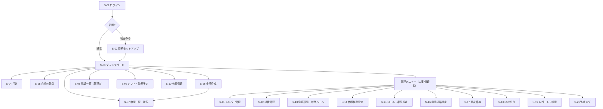
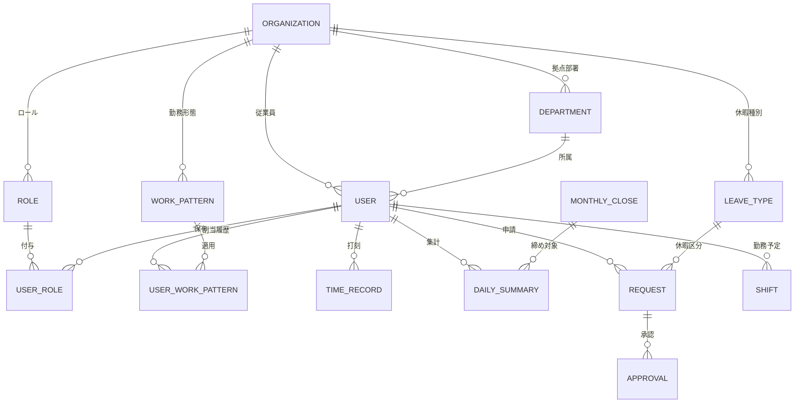
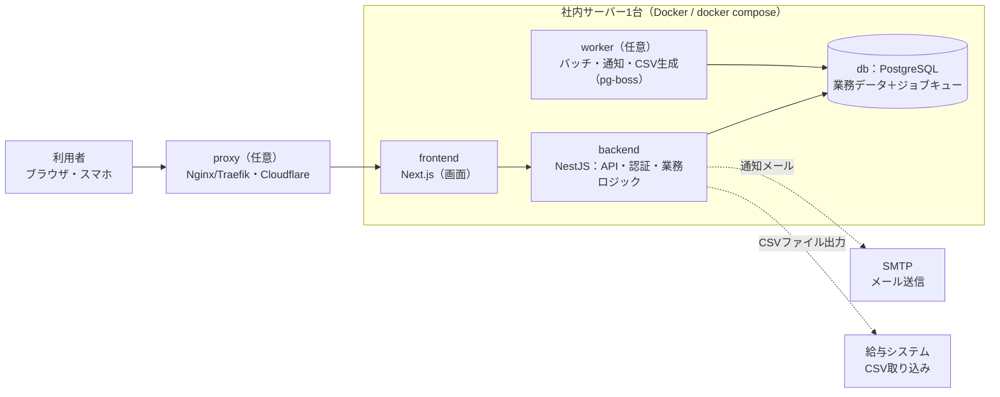
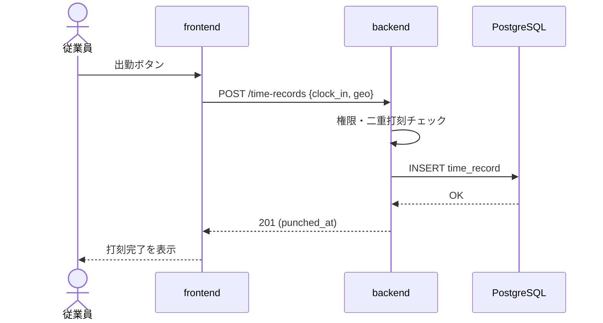
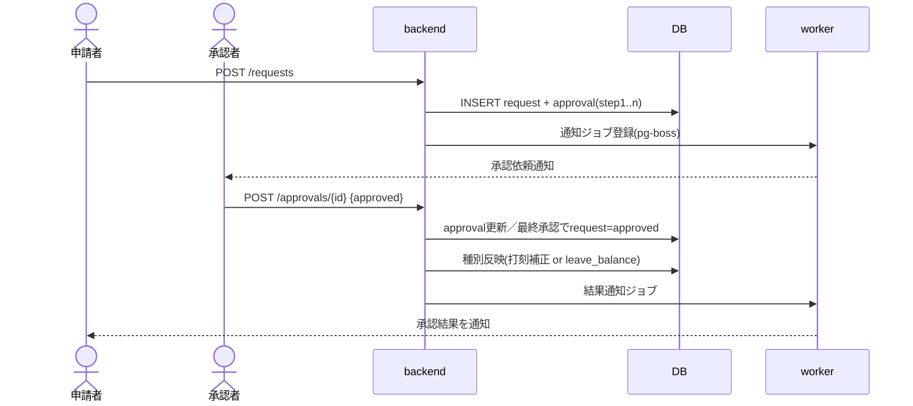
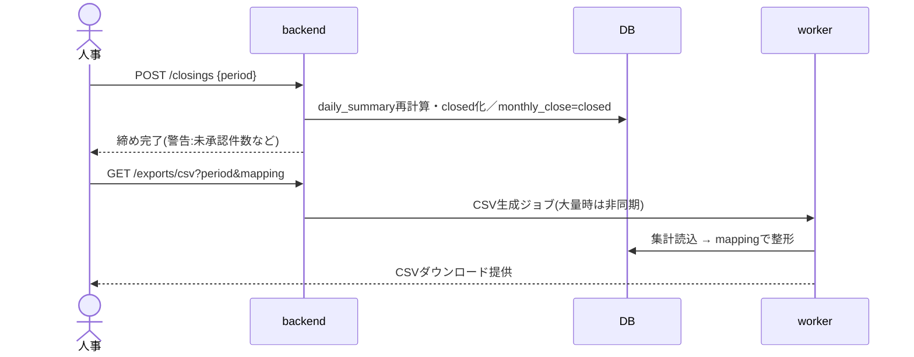

# 汎用勤怠管理システム（OSS） — 設計書一式

| 項目 | 内容 |
|---|---|
| プロダクト名 | 汎用勤怠管理システム（仮称・OSS公開予定） |
| 版数 | 1.0（統合版） |
| 作成日 | 2026-06-23 |
| 構成 | 第I部 要件定義／第II部 技術選定／第III部 基本設計／第IV部 詳細設計 |
| ステータス | **仕様確定** |

> ⚠️ 法令に関する具体的な数値・保存期間等は、**最新の法令および社会保険労務士の確認**を前提とします。本書中の「（仮定：〜）」は確認なしに置いた前提です。

## 改訂履歴

| 版 | 日付 | 変更内容 |
|---|---|---|
| 1.0 | 2026-06-23 | 要件定義(v1.1)・技術選定(v1.0)・基本設計(v1.0)・詳細設計を1ファイルに統合。提供形態は「シングルテナントOSS（自己ホスト・社内サーバー1台）」。汎用性は「導入時の組織別設定＋勤務形態の個人割当（有効期間つき）」で実現。 |

## 目次

- **第I部　要件定義書**（1.概要 / 2.前提・提供形態 / 3.ユーザーとロール / 4.機能要件 / 5.非機能要件 / 6.ユーザーストーリー / 7.スコープ / 8.制約 / 9.前提・仮定）
- **第II部　技術選定書**（0.方針 / 1.スタック / 2.テナント方式 / 3.Docker構成 / 4.ライセンス / 5.判断材料）
- **第III部　基本設計書**（1.方針 / 2.機能一覧 / 3.画面一覧 / 4.画面遷移図 / 5.データモデル / 6.権限設計 / 7.システム構成図）
- **第IV部　詳細設計書**（A.テーブル定義 / B.API詳細 / C.画面詳細 / D.処理シーケンス / E.エラー方針 / F.Docker手順）

---
---

# 第I部　要件定義書

> 要件定義書 v1.1 相当

## 1. プロジェクト概要

### 1.1 背景・目的
多様化する働き方（フレックス・変形労働・シフト勤務・在宅勤務など）に対し、既存の固定的な勤怠管理では運用が難しくなっている。本システムは、**勤務形態や就業ルールを組織ごとに柔軟に設定できる汎用的な勤怠管理基盤**を提供し、勤怠の記録・集計・申請承認・休暇/シフト管理・法令アラートを一元化する。**OSSとして公開し、各組織が自社サーバーに容易に導入（自己ホスト）できる**ことを目指す。

給与計算は本システムの対象外とし、**汎用CSV出力（項目マッピング可）**により外部の給与システムへ正確にデータを引き渡す。

### 1.2 システムのゴール
- 多様な勤務形態を「設定」で吸収し、企業ごとの就業規則に適合できる。
- 打刻〜集計〜締めを自動化し、労務担当の手作業と計算ミスを削減する。
- 長時間労働・有給取得義務などの法令リスクを可視化・アラートする。
- 給与システムとの連携を、相手を選ばないCSV出力で標準化する。
- **汎用性の核**：機能は汎用的に備えつつ、**導入時の組織別設定**と**従業員ごとの勤務形態割当（有効期間つき）**で自社仕様にできる。日々の個人設定や、組織による画面・入力項目の自作は行わない（MVP）。

## 2. 前提・提供形態

| 区分 | 内容 |
|---|---|
| 提供形態 | **シングルテナント型 OSS（自己ホスト）**。1インスタンス＝1組織。データ設計は organization（組織）起点とし、将来のマルチテナント化／ホスティング版（オープンコア）に余地を残す |
| 想定規模 | 数百〜数千人／複数拠点・部署あり。まずは**社内サーバー1台**での運用を想定 |
| プラットフォーム | **Web アプリケーション**（レスポンシブ：PC／タブレット／スマートフォン） |
| 実行・開発環境 | **Docker（コンテナ前提、`docker compose` 一発起動）** |
| ロール設計 | 固定ロールではなく、**組織側で自由定義できるカスタム権限（カスタムRBAC）** |
| 給与連携 | **汎用CSV出力（項目マッピング可）を標準装備**／API連携は将来 |
| 言語 | MVPは日本語のみ（多言語化しやすい設計を土台として用意） |

## 3. 想定ユーザーとロール

ロールは組織ごとに自由定義可能だが、初期テンプレートとして以下を標準提供する想定。

| 標準ロール例 | 主な役割 | 代表的な操作 |
|---|---|---|
| 一般従業員 | 自分の勤怠を記録・申請 | 打刻、打刻修正申請、残業/休暇申請、自分の勤怠閲覧 |
| 現場管理者 | 配下メンバーの管理 | 申請の承認/差戻し、シフト作成、部署勤怠の閲覧 |
| 人事・労務 | 全社の勤怠運用・設定 | 勤務形態/就業ルール/休暇種別/ロール設定、月次締め、CSV出力、全社集計 |
| 経営層 | 状況の俯瞰 | 長時間労働・有給取得状況などのダッシュボード閲覧 |
| システム管理者（自己ホスト運用者） | インスタンス全体の管理 | 初期セットアップ、組織・ユーザー管理、ロール定義、システム設定 |

> ロールに紐づく「アクセスできる機能」と「閲覧できるデータ範囲（自分／部署／拠点／全社）」を、組織側で自由に組み合わせられることを要件とする。

## 4. 機能要件

凡例：**★**＝汎用性の核となる機能／**区分**＝MVP（初期リリース）または 将来（拡張）

### 4.1 組織・システム管理
| ID | 機能名 | 概要 | 区分 |
|---|---|---|---|
| F-101 | 初期セットアップ | 自己ホスト時の初期構築（管理者作成・組織情報・基本設定）。将来のマルチテナント化に備え organization を起点に保持 | MVP |
| F-102 | 組織管理 | 会社／拠点／部署／グループの階層、所属の管理 | MVP |
| F-103 | ★初期設定（雛形） | 勤務形態・ロール・就業ルール・休暇種別の雛形を初期セットアップ時に柔軟設定 | MVP |

### 4.2 ユーザー・権限
| ID | 機能名 | 概要 | 区分 |
|---|---|---|---|
| F-201 | ユーザー管理 | 従業員の登録／異動／退職、雇用区分（正社員・契約・パート等） | MVP |
| F-202 | ★ロール・権限設定 | 組織ごとにロールを自由定義し、機能／データ範囲を割当（カスタムRBAC） | MVP |
| F-203 | 認証・ログイン | メール＋パスワード認証／SSO・MFA | MVP／将来 |

### 4.3 勤務形態・就業ルール
| ID | 機能名 | 概要 | 区分 |
|---|---|---|---|
| F-301 | ★勤務形態テンプレート | **固定／フレックス（コアタイム有無）／変形労働（1ヶ月）／シフト** を設定可能。組織で**複数を有効化**し、従業員へ**個人単位（有効期間つき）で割当**（同一部署でも混在可）。時短は所定労働時間設定で対応 | MVP |
| F-301b | 勤務形態テンプレート（拡張） | 裁量労働／事業場外みなし／変形労働（1年単位） | 将来 |
| F-302 | 就業ルール | 所定労働時間・休憩・時間丸め・深夜／法定休日／所定休日判定・残業区分 | MVP |
| F-303 | 締め日・勤怠期間 | 月次締め日、勤怠（給与）計算期間の定義 | MVP |

### 4.4 打刻
| ID | 機能名 | 概要 | 区分 |
|---|---|---|---|
| F-401 | 出退勤打刻 | 出勤／退勤／休憩 開始・終了（PCブラウザ） | MVP |
| F-402 | モバイル打刻 | スマートフォン打刻＋GPS位置情報 | MVP |
| F-403 | 打刻補正 | 申請に基づく打刻の修正 | MVP |
| F-404 | 外部打刻連携 | ICカード／生体認証／タイムレコーダー／チャット（Slack等） | 将来 |

### 4.5 申請・承認
| ID | 機能名 | 概要 | 区分 |
|---|---|---|---|
| F-501 | 各種申請 | 打刻修正・残業・遅刻早退・休暇・直行直帰・出張 | MVP |
| F-502 | 承認ワークフロー | 組織別に承認経路（多段／条件）を設定、代理承認 | MVP |
| F-503 | 申請状況管理 | 申請一覧・差戻し・取消 | MVP |

### 4.6 休暇管理
| ID | 機能名 | 概要 | 区分 |
|---|---|---|---|
| F-601 | 休暇種別管理 | 有給／振替・代休／特別休暇等を組織で定義 | MVP |
| F-602 | 有給休暇管理 | 自動付与・残数・取得履歴・時間単位／半休 | MVP |
| F-603 | 取得状況可視化 | 有給の取得状況（取得義務の把握等）を可視化 | MVP |

### 4.7 シフト・勤務予定
| ID | 機能名 | 概要 | 区分 |
|---|---|---|---|
| F-701 | 勤務予定／シフト | 個人・部署のシフト編成、希望提出、予実差異 | MVP |
| F-702 | シフト自動生成 | 需要に応じた自動編成・最適化 | 将来 |

### 4.8 集計・締め
| ID | 機能名 | 概要 | 区分 |
|---|---|---|---|
| F-801 | 日次集計 | 労働時間／残業／遅刻早退／休憩の自動計算 | MVP |
| F-802 | 月次締め | 月次確定・締め後ロック・再計算 | MVP |
| F-803 | 時間外集計 | 法定内／外・深夜・休日・36協定区分の集計 | MVP |

### 4.9 アラート・法令対応
| ID | 機能名 | 概要 | 区分 |
|---|---|---|---|
| F-901 | 時間外労働アラート | 上限（36協定）超過の事前／事後警告 | MVP |
| F-902 | 義務管理アラート | 有給取得義務・長時間労働者の把握 | MVP |
| F-903 | 客観的労働時間記録 | 打刻ベースの客観的記録の保持 | MVP |

### 4.10 連携・出力
| ID | 機能名 | 概要 | 区分 |
|---|---|---|---|
| F-1001 | ★汎用CSV出力 | 出力項目／形式／並びをマッピング設定し、給与システム向けに出力 | MVP |
| F-1002 | 帳票・レポート | 勤怠一覧／残業集計／有給管理表（CSV／Excel／PDF） | MVP |
| F-1003 | API連携 | 給与／人事システム連携、SSO／SCIM | 将来 |

### 4.11 共通
| ID | 機能名 | 概要 | 区分 |
|---|---|---|---|
| F-1101 | 通知 | 申請／承認／アラートのメール・アプリ内通知 | MVP |
| F-1102 | 監査ログ | 打刻修正／設定変更／操作の証跡 | MVP |
| F-1103 | ダッシュボード | ロール別の状況可視化 | MVP |

## 5. 非機能要件

> 数値は現時点の目標値（仮定）。

| 区分 | 方針・目標 |
|---|---|
| 性能 | 打刻レスポンス 1〜2秒以内。**始業時刻の打刻集中**（同時アクセスの急増・バーストトラフィック）を許容する設計 |
| 可用性 | 99.9% 目安。計画メンテナンス枠を設ける |
| スケーラビリティ | まず**社内サーバー1台**で運用。ユーザー数増加時に**後から水平スケール可能**な設計を保持 |
| セキュリティ | データは**組織単位でスコープ**、通信・保存データの暗号化、カスタムRBAC、監査ログ、個人情報保護法への対応（テナント間分離は将来オプション） |
| データ保持 | 労働関係に関する記録の保存に対応（保存期間は最新法令・社労士確認が必要：仮定） |
| 対応環境 | モダンブラウザ最新版、**レスポンシブ対応**（PC／タブレット／スマートフォン） |
| 国際化 | MVPは日本語のみ。文言の外部化等、**後から多言語化しやすい設計**を土台として用意 |
| アクセシビリティ | 十分なコントラスト・可読フォントサイズ等、基本的な配慮を行う |
| 運用性 | **Docker** 前提。IaC（構成のコード化）、バックアップ／リストア手順を整備 |
| 監査性 | 重要操作（打刻修正・設定変更・締め・CSV出力等）の証跡を保持 |

## 6. 主要ユーザーストーリー

| # | ロール | ストーリー |
|---|---|---|
| US-01 | 一般従業員 | スマホからGPS付きで打刻したい。直行直帰や在宅でも正確に記録したいから。 |
| US-02 | 一般従業員 | 打刻漏れを修正申請したい。後から実態に合わせて訂正したいから。 |
| US-03 | 一般従業員 | 残業や休暇を申請したい。所定のルールに沿って勤務したいから。 |
| US-04 | 現場管理者 | 配下の申請を承認しシフトを組みたい。現場の勤務を回す責任があるから。 |
| US-05 | 人事・労務 | 勤務形態・ロール・休暇種別を自由に設定したい。自社の就業規則に合わせたいから。 |
| US-06 | 人事・労務 | 月次を締めて給与システム向けCSVを出力したい。給与計算へ正確に引き渡したいから。 |
| US-07 | 経営層 | 長時間労働や有給取得状況を俯瞰したい。法令遵守と労務リスクを管理したいから。 |
| US-08 | システム管理者 | 組織・ユーザー・ロールをまとめて管理したい。自己ホストでスムーズに立ち上げたいから。 |

## 7. スコープ定義

### 7.1 やること（In Scope）
勤怠の記録・集計・申請承認・休暇/シフト管理・法令アラート・汎用CSV出力・**柔軟な設定**（勤務形態／就業ルール／ロール／休暇種別を組織ごとに自由設定）。**OSSとして自己ホスト可能**にする。

### 7.2 やらないこと（Out of Scope）
以下はいずれも**外部システムへCSV連携で引き渡す**前提とし、本システムでは扱わない。

- 給与計算
- 年末調整
- 社会保険手続き
- 人事評価
- 採用管理
- 経費精算
- 工数・プロジェクト別集計（将来オプションとして検討）

**パーソナライズの範囲**：自社への適合は「**導入時の組織別設定**」＋「**従業員ごとの勤務形態割当（有効期間つき）**」で実現する。以下はMVP対象外（必要に応じて将来）：個人レベルの詳細設定、組織による入力項目の自作（カスタムフィールド）、申請種別の自由定義、画面ラベル・用語のカスタマイズ。

## 8. 制約条件

| 区分 | 内容 |
|---|---|
| 法令 | 日本の労働法令準拠（労働基準法、時間外労働の上限規制／36協定、客観的な労働時間の把握、有給休暇の取得義務 等）。具体的な数値・保存期間は最新法令および社労士確認を前提とする。 |
| アーキテクチャ | **シングルテナント（1インスタンス＝1組織）**。データは organization 起点で、将来のマルチテナント化に余地を残す。 |
| 連携 | 給与計算は外部システム。**汎用CSV連携が標準**。 |
| 技術 | Web アプリケーション＋Docker を前提とする。**社内サーバー1台で `docker compose` 起動**できることを重視。 |
| 公開 | **OSSとして公開**予定（誰でも自己ホスト可能な配布性を重視）。 |

## 9. 前提・仮定の一覧

| # | 仮定した内容 | 確認の要否 |
|---|---|---|
| A-01 | 法令上の数値・保存期間は最新法令／社労士確認を前提とする | 導入企業ごとに要確認 |
| A-02 | 非機能要件の数値（可用性99.9% 等）は目標値 | 運用前に確定 |
| A-03 | 標準ロールはテンプレートであり、組織側で自由に変更可能 | 合意済み |
| A-04 | MVPは日本語のみ／多言語は将来 | 合意済み |
| A-05 | シングルテナントOSS／社内サーバー1台運用を前提 | 合意済み |

---
---

# 第II部　技術選定書

> 技術選定書 v1.0 相当

## 0. 選定の基本方針

本システムは **OSSとして公開**し、各組織が **社内サーバー1台**に容易に導入（自己ホスト）できることを最優先する。したがって技術選定は次の3点を重視した。

1. **配布性・導入容易性**：`docker compose up` 一発で起動できること。サービス数を最小に抑える。
2. **素性のよいOSS依存**：再配布しやすいパーミッシブ／OSSライセンスの部品で揃える。
3. **拡張余地**：まず1台・シングルテナントで動かしつつ、将来の水平スケール・マルチテナント化・SSO追加に余地を残す。

> 💡 設計（数千人・将来拡張）はしっかり保ちつつ、**最初から全部を作らない**。MVPは身軽に構築し、必要に応じて部品を足していく。

## 1. 技術スタック一覧

| レイヤー | 採用技術 | 主な対抗案 | 選定理由（要点） |
|---|---|---|---|
| フロントエンド | **React + TypeScript + Next.js** | Vue + Nuxt | 管理画面／ダッシュボードに強く、情報・人材が豊富。型をバックエンドと共有しやすい |
| UI | **Tailwind CSS + shadcn/ui** | MUI／Mantine | カスタムデザインしやすく、コンポーネントをコードとして同梱できOSS配布に向く |
| バックエンド | **Node.js + NestJS（TypeScript）** | Python+FastAPI／Go | 構造化された設計で業務ロジック（勤怠計算・ワークフロー）を整理しやすい。フロントと言語統一 |
| 認証 | **バックエンド内蔵**（Passport + セッション/JWT） | Keycloak／Auth0 | 別アプリを増やさず1台運用を軽量化。SSO/MFAは将来オプションで追加可能 |
| データベース | **PostgreSQL** | MySQL | 関係データに強く、`JSONB` で柔軟設定を保持。将来のマルチテナント化（RLS等）にも対応余地 |
| 非同期/ジョブ | **pg-boss（PostgreSQL上のジョブキュー）** | Redis + BullMQ | **Redisを不要にし**サービスを1つ削減。CSV生成・通知・バッチ・アラートを処理 |
| ORM | **Prisma** | TypeORM | 型安全で開発体験が良く、マイグレーションが堅実 |
| ファイル/出力 | **ローカルディスク（既定）／S3互換（任意）** | — | CSV・帳票の保存。自己ホストはローカルで完結、クラウド利用時はS3互換に切替可 |
| 帳票 | **CSV（標準）／Excel・PDF（ライブラリ）** | — | 給与連携はCSVが主。必要に応じてExcel/PDF出力 |
| メール送信 | **SMTP（設定式）** | 各種メールAPI | 通知・パスワードリセット等。自己ホスト側のSMTPを設定 |
| リバースプロキシ | **任意（Nginx／Traefik、または Cloudflare）** | — | 社内・イントラ運用なら省略可。インターネット公開時に採用者が選択 |
| 実行・開発環境 | **Docker / docker compose** | — | 開発も本番も同一構成。`docker compose up` で起動 |
| CI/CD | **GitHub Actions** | GitLab CI | OSS公開はGitHubが自然。ビルド・テスト・リリースを自動化 |
| テスト | **Jest（単体）／Playwright（E2E）** | Vitest／Cypress | 標準的で情報が多い |
| ログ/監視 | **構造化ログ（標準出力）＋任意で Sentry／Prometheus** | — | 自己ホストでも見やすいログ。監視は採用者が任意で追加 |

## 2. テナント方式（重要な設計判断）

| 項目 | 決定 |
|---|---|
| 方式 | **シングルテナント**（1インスタンス＝1組織） |
| データ起点 | すべてのデータを **organization（組織）** に紐づける構造にする |
| 将来拡張 | 上記により、ホスティング版（SaaS）を出す場合も**マルチテナント化しやすい**（オープンコア戦略に対応） |
| 「汎用・柔軟」の実現 | マルチテナントではなく、**組織内の“設定”**で実現（複数拠点・部署・勤務形態・ロールを自由に構成） |

## 3. 開発・実行環境（Docker構成）

### 3.1 サービス構成
```
services:
  frontend   … Next.js（React/TS）の画面
  backend    … NestJS（API＋認証＋業務ロジック）
  db         … PostgreSQL（業務データ ＋ ジョブキュー pg-boss を兼用）
  worker     … バッチ/非同期処理（任意：小規模なら backend に内包も可）
  proxy      … Nginx/Traefik もしくは Cloudflare（任意：公開時のみ）
```

### 3.2 最小起動構成（スモールスタート）
最小は **frontend ＋ backend ＋ db の3サービス**。これだけで打刻〜申請承認〜集計〜CSV出力まで動作する。利用が増えたら worker を分離、公開時に proxy を追加、という順で拡張する。

### 3.3 スケール拡張の道筋（将来）
1. **worker をbackendから分離**：バッチ・通知・CSV生成の負荷をAPIから切り離す。
2. **backend を複数インスタンス化＋proxyで負荷分散**：同時アクセス増へ対応。
3. **DBの増強／レプリケーション**：読み取り負荷の分散。
4. **（必要なら）マルチテナント化・SSO追加**：ホスティング版を出す場合。

## 4. ライセンス方針（OSS公開に向けて）

| 区分 | 方針 |
|---|---|
| 依存ライブラリ | React／Next.js／NestJS／PostgreSQL／Prisma 等、**再配布しやすいOSSライセンス**の部品で構成 |
| 本体ライセンス | **要決定**（候補：MIT／Apache-2.0 など。商標・特許条項の要否で選択） |
| オープンコア余地 | 将来、ホスティング版や上位機能（SSO/高度なマルチテナント等）を別ライセンスで提供する選択肢を残す |

> ⚠️ ライセンスは公開前に確定が必要。各依存の条項（特に再配布・帰属表示）を最終確認すること。

## 5. 選定時の判断材料（補足）

- **学習コスト**：フロント・バックともTypeScriptで統一し、習得対象を1言語に集約。
- **エコシステム**：React/NestJS/PostgreSQL はいずれも大規模コミュニティがあり、情報・ライブラリが豊富。
- **配布性**：サービス数を最小化（Keycloak・Redisを外す）したことで、自己ホストのハードルを大きく下げた。
- **スケーラビリティ**：1台構成から段階的に拡張できる道筋を確保。
- **将来適合性**：organization起点の設計でマルチテナント化・SaaS展開に対応余地。

---
---

# 第III部　基本設計書（外部設計）

> 基本設計書 v1.0 相当

## 1. 設計の基本方針

- **汎用性の核**：機能は汎用的に備え、自社への適合は「**導入時の組織別設定**」＋「**従業員ごとの勤務形態割当（有効期間つき）**」で実現する。
- 個人レベルの詳細設定、組織による画面・入力項目の自作、申請種別の自由定義、ラベル変更は **MVP対象外**（将来）。
- **organization（組織）起点**のデータ構造で、将来のマルチテナント化に余地を残す。
- 軽量OSS・**社内サーバー1台**（`docker compose`）で稼働。

## 2. 機能一覧

| 機能ID | 機能名 | 概要 |
|---|---|---|
| F-101 | 初期セットアップ | 自己ホスト時の初期構築（管理者作成・組織情報・基本設定） |
| F-102 | 組織管理 | 拠点／部署／グループの階層管理 |
| F-201 | ユーザー管理 | 従業員の登録／異動／退職、雇用区分 |
| F-202 | ロール・権限設定 | 組織ごとのカスタムRBAC（機能×データ範囲） |
| F-203 | 認証・ログイン | メール＋パスワード認証（SSO/MFAは将来） |
| F-301 | 勤務形態テンプレート | 固定/フレックス/変形(1ヶ月)/シフト。複数有効化し個人単位（有効期間つき）で割当 |
| F-302 | 就業ルール | 所定労働時間・休憩・丸め・深夜/休日判定・残業区分 |
| F-303 | 締め日・勤怠期間 | 月次締め日、勤怠期間の定義 |
| F-401 | 出退勤打刻 | 出勤/退勤/休憩（PCブラウザ） |
| F-402 | モバイル打刻 | スマホ打刻＋GPS |
| F-403 | 打刻補正 | 申請に基づく打刻修正 |
| F-501 | 各種申請 | 打刻修正/残業/遅刻早退/休暇/直行直帰/出張 |
| F-502 | 承認ワークフロー | 多段/条件の承認経路、代理承認 |
| F-503 | 申請状況管理 | 申請一覧・差戻し・取消 |
| F-601 | 休暇種別管理 | 有給/振替/特別休暇等を組織で定義 |
| F-602 | 有給休暇管理 | 自動付与・残数・取得履歴・時間単位/半休 |
| F-603 | 取得状況可視化 | 有給取得義務などの把握 |
| F-701 | 勤務予定/シフト | 個人・部署の編成、希望提出、予実差異 |
| F-801 | 日次集計 | 労働時間/残業/遅刻早退の自動計算 |
| F-802 | 月次締め | 月次確定・ロック・再計算 |
| F-803 | 時間外集計 | 法定内/外・深夜・休日・36協定区分 |
| F-901 | 時間外労働アラート | 上限（36協定）超過の警告 |
| F-902 | 義務管理アラート | 有給取得義務・長時間労働の把握 |
| F-903 | 客観的労働時間記録 | 打刻ベースの客観記録の保持 |
| F-1001 | 汎用CSV出力 | 出力項目/形式/並びのマッピング設定と出力 |
| F-1002 | 帳票・レポート | 勤怠一覧/残業集計/有給管理表（CSV/Excel/PDF） |
| F-1101 | 通知 | 申請/承認/アラートのメール・アプリ内通知 |
| F-1102 | 監査ログ | 重要操作の証跡 |
| F-1103 | ダッシュボード | ロール別の状況可視化 |

## 3. 画面一覧

| ID | 画面名 | 主な利用ロール | 概要 |
|---|---|---|---|
| S-01 | ログイン | 全員 | メール＋パスワード認証 |
| S-02 | 初期セットアップ | システム管理者 | 初回のみ。管理者作成・組織情報・基本設定 |
| S-03 | ダッシュボード | 全員（ロール別表示） | 勤怠サマリ／承認待ち／アラート |
| S-04 | 打刻 | 一般従業員 | 出退勤・休憩（PC/モバイル・GPS） |
| S-05 | 自分の勤怠 | 一般従業員 | 月カレンダー／日次明細／労働時間 |
| S-06 | 申請作成 | 一般従業員 | 打刻修正/残業/休暇/直行直帰 等 |
| S-07 | 申請一覧・状況 | 一般従業員 | 申請履歴・差戻し・取消 |
| S-08 | 承認一覧 | 現場管理者 | 承認/差戻し（一括対応） |
| S-09 | シフト・勤務予定 | 一般従業員／現場管理者 | 予定確認・希望提出・シフト編成 |
| S-10 | 休暇管理 | 一般従業員／人事 | 残数・取得履歴・取得義務状況 |
| S-11 | メンバー管理 | 人事・労務 | 従業員の登録/異動/退職・雇用区分 |
| S-12 | 組織管理 | 人事・労務／管理者 | 拠点・部署の階層管理 |
| S-13 | 勤務形態・就業ルール設定 | 人事・労務 | テンプレ作成・所定時間/丸め/残業区分・個人割当 |
| S-14 | 休暇種別設定 | 人事・労務 | 有給/振替/特別休暇の定義・付与ルール |
| S-15 | ロール・権限設定 | 管理者／人事 | カスタムRBAC（機能×データ範囲） |
| S-16 | 承認経路設定 | 管理者／人事 | 多段/条件の承認フロー |
| S-17 | 月次締め | 人事・労務 | 締め・ロック・再計算 |
| S-18 | CSV出力 | 人事・労務 | 項目マッピング設定・出力 |
| S-19 | レポート・帳票 | 人事／経営層 | 勤怠一覧/残業集計/有給管理表 |
| S-20 | 通知一覧 | 全員 | 申請/承認/アラート通知（共通ヘッダー） |
| S-21 | 監査ログ | 管理者 | 重要操作の証跡閲覧 |
| S-22 | 個人設定 | 全員 | プロフィール・パスワード・通知設定（共通ヘッダー） |

## 4. 画面遷移図

ログイン後の**ダッシュボードを起点（ハブ）**に、日常利用と管理・設定へ分岐する。通知（S-20）・個人設定（S-22）は全画面共通のヘッダーから随時アクセス。



## 5. データモデル概要

### 5.1 ER図（主要エンティティ）

すべて **ORGANIZATION（組織）** を起点とする。勤務形態は組織で複数有効化し、**USER_WORK_PATTERN（有効期間つき割当）**で従業員へ個別割当する（同一部署でも混在可）。



### 5.2 エンティティ一覧（◎＝中核）

| エンティティ | 概要 | 主なキー項目 |
|---|---|---|
| ◎ ORGANIZATION（組織） | 最上位。1インスタンス＝1組織。導入時の組織設定・機能ON/OFFを `settings` に保持 | id, name, settings(JSONB) |
| ◎ DEPARTMENT（拠点・部署） | 組織配下の階層（parent_idで多階層） | id, org_id, parent_id, name |
| EMPLOYMENT_TYPE（雇用区分） | 正社員/契約/パート等 | id, org_id, name |
| ◎ USER（従業員） | アカウント。組織・部署・雇用区分に紐づく | id, org_id, dept_id, email, status |
| ◎ ROLE（ロール） | 組織が自由定義。権限セットを保持 | id, org_id, name, permissions(JSONB) |
| ◎ USER_ROLE（割当） | ユーザーとロールの割当（多対多） | user_id, role_id |
| ◎ WORK_PATTERN（勤務形態） | 固定/フレックス/変形/シフトのテンプレ | id, org_id, type, rule(JSONB) |
| ◎ USER_WORK_PATTERN（勤務形態割当） | 従業員への割当。**有効期間つき** | user_id, work_pattern_id, start_date, end_date |
| WORK_RULE（就業ルール） | 所定時間・休憩・丸め・残業区分 | id, org_id, pattern_id |
| CLOSING_PERIOD（締め期間） | 締め日・勤怠期間の定義 | id, org_id, close_day |
| ◎ TIME_RECORD（打刻） | 出退勤・休憩の客観記録 | id, user_id, punched_at, source, geo |
| ◎ DAILY_SUMMARY（日次集計） | 労働/残業/遅刻早退の自動計算結果 | id, user_id, work_date, worked_min, overtime_min |
| MONTHLY_CLOSE（月次締め） | 月次確定・ロック状態 | id, org_id, period, status |
| ◎ REQUEST（申請） | 打刻修正/残業/休暇/直行直帰/出張 | id, user_id, type, status, payload(JSONB) |
| APPROVAL_ROUTE（承認経路） | 多段/条件の承認フロー定義 | id, org_id, steps(JSONB) |
| APPROVAL（承認） | 各申請の承認ステップ・結果 | id, request_id, approver_id, result |
| ◎ LEAVE_TYPE（休暇種別） | 有給/振替/特別休暇等 | id, org_id, name, paid |
| LEAVE_BALANCE（休暇残数） | 種別ごとの付与・残数 | id, user_id, leave_type_id, granted, used |
| SHIFT（勤務予定・シフト） | 個人/部署の予定・希望・予実 | id, user_id, shift_date, planned |
| AUDIT_LOG（監査ログ） | 打刻修正/設定変更/締め等の証跡 | id, actor_id, action, target, at |
| CSV_MAPPING（CSV出力設定） | 出力項目/形式/並びのマッピング | id, org_id, name, mapping(JSONB) |
| NOTIFICATION（通知） | 申請/承認/アラートの通知 | id, user_id, type, read |

## 6. 権限（カスタムRBAC）設計

### 6.1 基本モデル
**1つの権限 ＝「何ができるか（機能）」×「誰のデータまで（範囲）」**。

- **機能（操作）**：閲覧／作成／編集／承認／設定 など
- **データ範囲（scope）**：`自分（self） → 部署（department） → 拠点（location） → 組織全体（org）` の4段階
- **ロール**：権限の集合。**組織ごとに自由定義**（テンプレを複製して調整）
- **ユーザー**：複数ロールを保持可（USER_ROLE）

### 6.2 標準ロールの初期権限（テンプレート）
範囲＝そのデータをどこまで扱えるか。空欄＝権限なし。△＝任意で付与。

| 機能 | 一般従業員 | 現場管理者 | 人事・労務 | 経営層 | システム管理者 |
|---|---|---|---|---|---|
| 打刻 | 自分 | 自分 | 自分 | 自分 | 自分 |
| 勤怠閲覧 | 自分 | 部署 | 全社 | 全社 | 全社 |
| 申請 | 自分 | 自分 | 自分 | — | 自分 |
| 承認 | — | 部署 | 全社 | — | 全社 |
| シフト編成 | 希望のみ | 部署 | 全社 | — | 全社 |
| メンバー管理 | — | — | 全社 | — | 全社 |
| 組織・各種設定 | — | — | 全社 | — | 全社 |
| ロール・権限設定 | — | — | △ | — | 全社 |
| 月次締め | — | — | 全社 | — | 全社 |
| CSV出力 | — | — | 全社 | — | 全社 |
| レポート閲覧 | 自分 | 部署 | 全社 | 全社 | 全社 |
| 監査ログ | — | — | △ | — | 全社 |

> これらは初期テンプレートであり、各組織が導入時に複製・調整できる（＝カスタムRBAC）。

## 7. システム構成図

技術選定（軽量OSS・1台）に基づくサービス構成。**最小は frontend・backend・db の3つ**、worker と proxy は任意。



---
---

# 第IV部　詳細設計書（内部設計）

> 対象範囲：MVP中核（打刻・申請承認・勤務形態割当・集計・月次締め・CSV出力・RBAC）を実装できる粒度で詳細化。周辺機能（通知・監査ログ・レポート等）は要点設計に留める。

## A. テーブル定義（PostgreSQL）

**設計方針**：PKは `UUID`、各テーブルに `org_id`（組織起点）、可変な設定は `JSONB`、`user` は予約語のため **`app_user`** を使用。

> ※実マイグレーションでは依存関係順に作成（例：`leave_type` は `request` より前、`request` は `approval` より前）。以下は可読性のため業務カテゴリ順に記載。

### A-1. 組織・ユーザー・権限
```sql
CREATE TABLE organization (
  id         UUID PRIMARY KEY DEFAULT gen_random_uuid(),
  name       VARCHAR(200) NOT NULL,
  settings   JSONB NOT NULL DEFAULT '{}',   -- 導入時の組織設定・機能ON/OFF
  created_at TIMESTAMPTZ NOT NULL DEFAULT now(),
  updated_at TIMESTAMPTZ NOT NULL DEFAULT now()
);

CREATE TABLE department (
  id         UUID PRIMARY KEY DEFAULT gen_random_uuid(),
  org_id     UUID NOT NULL REFERENCES organization(id),
  parent_id  UUID REFERENCES department(id),         -- 多階層
  name       VARCHAR(200) NOT NULL,
  kind       VARCHAR(20) NOT NULL DEFAULT 'department', -- location/department/group
  sort_order INT NOT NULL DEFAULT 0
);
CREATE INDEX idx_dept_org ON department(org_id);

CREATE TABLE employment_type (
  id     UUID PRIMARY KEY DEFAULT gen_random_uuid(),
  org_id UUID NOT NULL REFERENCES organization(id),
  name   VARCHAR(100) NOT NULL
);

CREATE TABLE app_user (
  id                 UUID PRIMARY KEY DEFAULT gen_random_uuid(),
  org_id             UUID NOT NULL REFERENCES organization(id),
  dept_id            UUID REFERENCES department(id),
  employment_type_id UUID REFERENCES employment_type(id),
  email              VARCHAR(255) NOT NULL,
  password_hash      VARCHAR(255) NOT NULL,
  name               VARCHAR(120) NOT NULL,
  employee_code      VARCHAR(60),
  status             VARCHAR(20) NOT NULL DEFAULT 'active', -- active/suspended/retired
  hired_on           DATE,
  retired_on         DATE,
  created_at         TIMESTAMPTZ NOT NULL DEFAULT now(),
  updated_at         TIMESTAMPTZ NOT NULL DEFAULT now(),
  UNIQUE (org_id, email)
);
CREATE INDEX idx_user_org ON app_user(org_id);
CREATE INDEX idx_user_dept ON app_user(dept_id);

CREATE TABLE role (
  id          UUID PRIMARY KEY DEFAULT gen_random_uuid(),
  org_id      UUID NOT NULL REFERENCES organization(id),
  name        VARCHAR(100) NOT NULL,
  is_template BOOLEAN NOT NULL DEFAULT false,
  permissions JSONB NOT NULL DEFAULT '[]',  -- [{feature, action, scope}]
  UNIQUE (org_id, name)
);

CREATE TABLE user_role (
  user_id UUID NOT NULL REFERENCES app_user(id) ON DELETE CASCADE,
  role_id UUID NOT NULL REFERENCES role(id) ON DELETE CASCADE,
  PRIMARY KEY (user_id, role_id)
);
```
`role.permissions` の形：`[{ "feature":"attendance", "action":"view", "scope":"department" }, …]`（scope＝`self`/`department`/`location`/`org`）

### A-2. 勤務形態・就業ルール（個人割当は有効期間つき）
```sql
CREATE TABLE work_pattern (
  id        UUID PRIMARY KEY DEFAULT gen_random_uuid(),
  org_id    UUID NOT NULL REFERENCES organization(id),
  name      VARCHAR(120) NOT NULL,
  type      VARCHAR(30) NOT NULL,            -- fixed/flex/variable_month/shift
  rule      JSONB NOT NULL DEFAULT '{}',     -- コアタイム/清算期間等(型別)
  is_active BOOLEAN NOT NULL DEFAULT true
);

CREATE TABLE work_rule (
  id                UUID PRIMARY KEY DEFAULT gen_random_uuid(),
  org_id            UUID NOT NULL REFERENCES organization(id),
  work_pattern_id   UUID NOT NULL REFERENCES work_pattern(id) ON DELETE CASCADE,
  scheduled_minutes INT NOT NULL DEFAULT 480,  -- 所定労働(分)
  break_minutes     INT NOT NULL DEFAULT 60,
  rounding_unit     INT NOT NULL DEFAULT 1,     -- 丸め単位(分)
  rounding_method   VARCHAR(10) NOT NULL DEFAULT 'none', -- none/up/down/nearest
  overtime_rule     JSONB NOT NULL DEFAULT '{}'  -- 法定内外/深夜/休日区分
);

CREATE TABLE user_work_pattern (              -- ★勤務形態の個人割当（履歴）
  id              UUID PRIMARY KEY DEFAULT gen_random_uuid(),
  user_id         UUID NOT NULL REFERENCES app_user(id) ON DELETE CASCADE,
  work_pattern_id UUID NOT NULL REFERENCES work_pattern(id),
  start_date      DATE NOT NULL,
  end_date        DATE,                        -- NULL=現在も有効
  EXCLUDE USING gist (                         -- 同一ユーザーの期間重複を禁止
    user_id WITH =,
    daterange(start_date, COALESCE(end_date,'infinity'), '[]') WITH &&
  )
);
CREATE INDEX idx_uwp_user ON user_work_pattern(user_id);

CREATE TABLE closing_period (
  id        UUID PRIMARY KEY DEFAULT gen_random_uuid(),
  org_id    UUID NOT NULL REFERENCES organization(id),
  close_day INT NOT NULL DEFAULT 31            -- 締め日(末日=31扱い)
);
```

### A-3. 打刻・集計・締め
```sql
CREATE TABLE time_record (
  id           UUID PRIMARY KEY DEFAULT gen_random_uuid(),
  user_id      UUID NOT NULL REFERENCES app_user(id),
  punch_type   VARCHAR(20) NOT NULL,           -- clock_in/clock_out/break_start/break_end
  punched_at   TIMESTAMPTZ NOT NULL,
  source       VARCHAR(20) NOT NULL DEFAULT 'web', -- web/mobile
  geo_lat      NUMERIC(9,6),
  geo_lng      NUMERIC(9,6),
  is_corrected BOOLEAN NOT NULL DEFAULT false,
  request_id   UUID,                            -- 補正申請由来
  created_at   TIMESTAMPTZ NOT NULL DEFAULT now()
);
CREATE INDEX idx_tr_user_time ON time_record(user_id, punched_at);

CREATE TABLE daily_summary (
  id                  UUID PRIMARY KEY DEFAULT gen_random_uuid(),
  user_id             UUID NOT NULL REFERENCES app_user(id),
  work_date           DATE NOT NULL,
  worked_minutes      INT NOT NULL DEFAULT 0,
  overtime_minutes    INT NOT NULL DEFAULT 0,
  late_night_minutes  INT NOT NULL DEFAULT 0,
  holiday_minutes     INT NOT NULL DEFAULT 0,
  late_minutes        INT NOT NULL DEFAULT 0,
  early_leave_minutes INT NOT NULL DEFAULT 0,
  status              VARCHAR(20) NOT NULL DEFAULT 'open', -- open/closed
  UNIQUE (user_id, work_date)
);

CREATE TABLE monthly_close (
  id        UUID PRIMARY KEY DEFAULT gen_random_uuid(),
  org_id    UUID NOT NULL REFERENCES organization(id),
  period    CHAR(7) NOT NULL,                  -- 'YYYY-MM'
  status    VARCHAR(20) NOT NULL DEFAULT 'open', -- open/closed
  closed_by UUID REFERENCES app_user(id),
  closed_at TIMESTAMPTZ,
  UNIQUE (org_id, period)
);
```

### A-4. 申請・承認
```sql
CREATE TABLE request (
  id            UUID PRIMARY KEY DEFAULT gen_random_uuid(),
  org_id        UUID NOT NULL REFERENCES organization(id),
  user_id       UUID NOT NULL REFERENCES app_user(id),
  type          VARCHAR(30) NOT NULL,          -- punch_fix/overtime/late_early/leave/direct/business_trip
  status        VARCHAR(20) NOT NULL DEFAULT 'pending', -- pending/approved/rejected/canceled
  leave_type_id UUID REFERENCES leave_type(id),
  payload       JSONB NOT NULL DEFAULT '{}',   -- 対象日時/理由/行先等(種別別)
  current_step  INT NOT NULL DEFAULT 1,
  created_at    TIMESTAMPTZ NOT NULL DEFAULT now()
);
CREATE INDEX idx_req_status ON request(org_id, status);

CREATE TABLE approval_route (
  id         UUID PRIMARY KEY DEFAULT gen_random_uuid(),
  org_id     UUID NOT NULL REFERENCES organization(id),
  name       VARCHAR(120) NOT NULL,
  applies_to VARCHAR(30) NOT NULL DEFAULT 'all',
  steps      JSONB NOT NULL DEFAULT '[]'       -- [{step, approver_type, approver_ref}]
);

CREATE TABLE approval (
  id          UUID PRIMARY KEY DEFAULT gen_random_uuid(),
  request_id  UUID NOT NULL REFERENCES request(id) ON DELETE CASCADE,
  step        INT NOT NULL,
  approver_id UUID REFERENCES app_user(id),
  result      VARCHAR(20) NOT NULL DEFAULT 'pending', -- pending/approved/rejected
  comment     TEXT,
  acted_at    TIMESTAMPTZ,
  UNIQUE (request_id, step)
);
CREATE INDEX idx_approval_approver ON approval(approver_id, result);
```

### A-5. 休暇・シフト・出力・周辺
```sql
CREATE TABLE leave_type (
  id         UUID PRIMARY KEY DEFAULT gen_random_uuid(),
  org_id     UUID NOT NULL REFERENCES organization(id),
  name       VARCHAR(120) NOT NULL,
  paid       BOOLEAN NOT NULL DEFAULT true,
  unit       VARCHAR(10) NOT NULL DEFAULT 'day', -- day/half/hour
  grant_rule JSONB NOT NULL DEFAULT '{}'
);

CREATE TABLE leave_balance (
  id              UUID PRIMARY KEY DEFAULT gen_random_uuid(),
  user_id         UUID NOT NULL REFERENCES app_user(id) ON DELETE CASCADE,
  leave_type_id   UUID NOT NULL REFERENCES leave_type(id),
  granted_minutes INT NOT NULL DEFAULT 0,
  used_minutes    INT NOT NULL DEFAULT 0,
  expires_on      DATE,
  UNIQUE (user_id, leave_type_id, expires_on)
);

CREATE TABLE shift (
  id         UUID PRIMARY KEY DEFAULT gen_random_uuid(),
  user_id    UUID NOT NULL REFERENCES app_user(id),
  shift_date DATE NOT NULL,
  start_time TIME,
  end_time   TIME,
  kind       VARCHAR(20) NOT NULL DEFAULT 'planned', -- planned/requested
  UNIQUE (user_id, shift_date, kind)
);

CREATE TABLE csv_mapping (
  id       UUID PRIMARY KEY DEFAULT gen_random_uuid(),
  org_id   UUID NOT NULL REFERENCES organization(id),
  name     VARCHAR(120) NOT NULL,
  mapping  JSONB NOT NULL DEFAULT '[]',        -- [{column, source, format, order}]
  encoding VARCHAR(20) NOT NULL DEFAULT 'utf-8' -- utf-8/shift_jis
);

-- 周辺（要点設計）
CREATE TABLE audit_log (
  id     UUID PRIMARY KEY DEFAULT gen_random_uuid(),
  org_id UUID NOT NULL, actor_id UUID,
  action VARCHAR(60) NOT NULL, target VARCHAR(120), detail JSONB,
  at     TIMESTAMPTZ NOT NULL DEFAULT now()
);
CREATE TABLE notification (
  id      UUID PRIMARY KEY DEFAULT gen_random_uuid(),
  user_id UUID NOT NULL, type VARCHAR(40) NOT NULL, payload JSONB,
  read    BOOLEAN NOT NULL DEFAULT false,
  created_at TIMESTAMPTZ NOT NULL DEFAULT now()
);
```

## B. API詳細（REST）

ベース：`/api/v1`。認証は **HttpOnlyセッションCookieまたはJWT**。全エンドポイントで**ロール権限（機能×scope）**を検査。

### B-1. エンドポイント一覧（主要）

| リソース | メソッド／パス | 概要 | 権限 |
|---|---|---|---|
| 認証 | POST `/auth/login` / `/auth/logout` / GET `/auth/me` | ログイン・自分情報 | 全員 |
| 組織 | GET/PATCH `/organization` | 組織設定の取得・更新 | 管理者 |
| 部署 | GET/POST `/departments` ・ PATCH/DELETE `/departments/{id}` | 組織階層 | 人事 |
| メンバー | GET/POST `/users` ・ PATCH `/users/{id}` | 従業員管理 | 人事 |
| 勤務形態割当 | GET/POST `/users/{id}/work-patterns` | 個人へ割当（期間つき） | 人事 |
| ロール | GET/POST `/roles` ・ PATCH `/roles/{id}` | カスタムRBAC | 管理者 |
| 勤務形態 | GET/POST `/work-patterns` ・ 就業ルール | テンプレ・ルール | 人事 |
| 打刻 | POST `/time-records` ・ GET `/time-records` | 打刻・取得 | 本人 |
| 勤怠 | GET `/summaries/daily` ・ `/summaries/monthly` | 集計取得 | scope準拠 |
| 申請 | POST `/requests` ・ GET `/requests` ・ POST `/requests/{id}/cancel` | 申請・取消 | 本人 |
| 承認 | GET `/approvals` ・ POST `/approvals/{id}` | 承認待ち・承認/差戻 | 承認者 |
| 休暇 | GET `/leave-balances` ・ `/leave-types`(CRUD) | 残数・種別 | 本人/人事 |
| シフト | GET/POST `/shifts` | 予定・希望 | scope準拠 |
| 月次締め | POST `/closings` ・ POST `/closings/{id}/reopen` | 締め・解除 | 人事 |
| CSV | GET `/exports/csv?period=&mapping_id=` ・ `/csv-mappings`(CRUD) | 出力・設定 | 人事 |
| 通知 | GET `/notifications` ・ POST `/notifications/{id}/read` | 通知 | 本人 |

### B-2. 主要エンドポイントの詳細

**打刻** `POST /api/v1/time-records`
```jsonc
// Request
{ "punch_type": "clock_in", "source": "mobile", "geo": { "lat": 33.59, "lng": 130.40 } }
// 201 Created
{ "id": "…", "punch_type": "clock_in", "punched_at": "2026-06-23T09:01:00+09:00" }
// 409 Conflict（例：退勤前に再度clock_in）/ 401 未認証
```

**申請作成** `POST /api/v1/requests`
```jsonc
// Request（打刻修正の例）
{ "type": "punch_fix", "payload": { "target_date": "2026-06-22",
  "fix": [{ "punch_type": "clock_out", "punched_at": "2026-06-22T18:30:00+09:00" }],
  "reason": "打刻忘れ" } }
// 201 Created → status:"pending"、承認経路に従いapprovalを自動生成
{ "id": "…", "status": "pending", "current_step": 1 }
// 422 入力不正（対象日が締め済み 等）
```

**承認/差戻し** `POST /api/v1/approvals/{id}`
```jsonc
// Request
{ "result": "approved", "comment": "確認しました" }   // または "rejected"
// 200 OK：最終ステップ承認でrequest.status=approved。差戻しはrejected
// 承認時、種別に応じ time_record 補正や leave_balance 反映を実行
// 403 自分が承認者でない / 409 既に処理済み
```

**月次締め** `POST /api/v1/closings`
```jsonc
// Request
{ "period": "2026-06" }
// 200 OK：対象期間のdaily_summaryをclosed化しロック。未承認申請が残れば警告
{ "period": "2026-06", "status": "closed", "warnings": ["未承認の申請が3件あります"] }
```

**CSV出力** `GET /api/v1/exports/csv?period=2026-06&mapping_id=…`
```
200 OK / Content-Type: text/csv（mappingの項目・並び・エンコーディングで出力）
404 mapping未指定・不正 / 409 未締めデータを含む（設定で許可/拒否）
```

## C. 画面詳細（MVP中核）

各画面の構成・入力検証・状態（空／読込中／エラー）を定義。周辺画面（S-10/S-12/S-14/S-19/S-20/S-21等）は「一覧＋詳細／編集」の標準パターンに準じる。

### S-04 打刻
- **要素**：現在時刻の大型表示、出勤／退勤／休憩開始／休憩終了ボタン、本日の打刻履歴、（モバイル時）GPS取得状態
- **入力・検証**：位置情報は許可時のみ送信。**二重打刻防止**（退勤前の再出勤、休憩の開始終了整合を無効化）
- **状態**：空＝本日未打刻でガイド表示／読込中＝ボタン無効化＋スピナー／エラー＝失敗時は時刻を確定せず再試行を促す

### S-06 申請作成
- **要素**：種別タブ（打刻修正／残業／遅刻早退／休暇／直行直帰／出張）、対象日時、理由、種別別フォーム（休暇＝休暇種別・半休/時間、出張＝行先）
- **入力・検証**：必須＝対象日・理由。**締め済み期間は対象選択不可**。休暇は**残数を超える申請を警告**。送信前に承認経路をプレビュー
- **状態**：空＝種別未選択の初期／読込中＝送信中／エラー＝422時は項目単位でメッセージ表示

### S-08 承認一覧
- **要素**：承認待ちリスト（申請者・種別・対象日・申請内容）、承認／差戻しボタン、コメント、一括承認、代理承認バッジ
- **入力・検証**：差戻しは**コメント必須**。自分が承認者のステップのみ操作可。処理済みは非活性
- **状態**：空＝「承認待ちはありません」／読込中＝スケルトン／エラー＝409（他者が処理済み）は一覧を再取得

### S-13 勤務形態・就業ルール設定＋個人割当
- **要素**：勤務形態テンプレ一覧（固定/フレックス/変形/シフト）、就業ルール（所定時間・休憩・丸め単位/方法・残業区分）、**従業員への割当（開始日・終了日）**
- **入力・検証**：丸め単位は1〜60分。**同一従業員の割当期間が重複する場合はエラー**（DB EXCLUDE制約と整合）。終了日＞開始日
- **状態**：空＝テンプレ未作成のガイド／読込中／エラー＝重複・矛盾はフォーム上で明示

### S-15 ロール・権限設定
- **要素**：ロール一覧、権限マトリクス（機能×操作）、**データ範囲セレクタ（自分/部署/拠点/全社）**、テンプレ複製ボタン
- **入力・検証**：ロール名は組織内で一意。最低1つの管理権限を持つロールの存在を保証（**自分の管理権限を誤って全消ししない**ガード）
- **状態**：空＝テンプレから複製を促す／読込中／エラー＝保存失敗時は変更を保持

### S-17 月次締め／S-18 CSV出力
- **S-17 要素**：対象期間選択、未承認申請・未打刻の**事前チェック結果**、締め実行、再オープン（権限者のみ）
- **S-18 要素**：マッピング選択（項目・並び・エンコーディング utf-8/shift_jis）、プレビュー、ダウンロード
- **検証**：締めは未確定データへの警告を表示し、続行可否は組織設定に従う。CSVは未締めデータ混在時に警告
- **状態**：処理中は大型プログレス、完了でダウンロード活性化、エラーは原因（未承認件数等）を提示

## D. 処理シーケンス

### 打刻


### 申請 → 承認 → 反映


### 月次締め → CSV出力


## E. エラーハンドリング方針

**統一レスポンス形式**
```jsonc
{ "error": { "code": "VALIDATION_ERROR", "message": "対象日は締め済みです",
  "details": [{ "field": "payload.target_date", "reason": "period_closed" }] } }
```

**HTTPステータスの方針**

| コード | 用途 |
|---|---|
| 400 / 422 | リクエスト不正／業務バリデーション違反（締め済み編集・残数超過・期間重複 等） |
| 401 / 403 | 未認証／権限（機能×scope）不足 |
| 404 | リソースなし |
| 409 | 競合（二重打刻・既処理の承認・期間重複） |
| 500 | サーバ内部エラー（詳細は出さずログIDのみ返す） |

**方針**
- バリデーションは**フロント即時＋バックエンド最終**の二段。最終判断は必ずバックエンド。
- 業務エラーは原因コード（`period_closed` / `balance_exceeded` / `overlap` / `double_punch`）で機械可読に。
- 打刻など失敗時は**値を確定させず**冪等に再試行可能とする。
- 重要操作（打刻修正・設定変更・締め・CSV出力）は成否を **audit_log** に記録。

## F. 開発環境セットアップ（Docker）

**`compose.yaml`（最小＝db/backend/frontend、worker・proxyは任意）**
```yaml
services:
  db:
    image: postgres:16
    environment:
      POSTGRES_DB: attendance
      POSTGRES_USER: app
      POSTGRES_PASSWORD: ${DB_PASSWORD}
    volumes: [ "db-data:/var/lib/postgresql/data" ]
    healthcheck:
      test: ["CMD-SHELL", "pg_isready -U app"]
      interval: 10s
  backend:
    build: ./backend
    environment:
      DATABASE_URL: postgres://app:${DB_PASSWORD}@db:5432/attendance
      JWT_SECRET: ${JWT_SECRET}
      SMTP_URL: ${SMTP_URL}
    depends_on: { db: { condition: service_healthy } }
    ports: [ "3000:3000" ]
  worker:                      # 任意（非同期/バッチ）
    build: ./backend
    command: ["node", "dist/worker.js"]
    environment:
      DATABASE_URL: postgres://app:${DB_PASSWORD}@db:5432/attendance
    depends_on: { db: { condition: service_healthy } }
  frontend:
    build: ./frontend
    environment:
      API_BASE_URL: http://backend:3000/api/v1
    depends_on: [ backend ]
    ports: [ "8080:8080" ]
volumes:
  db-data:
```

**Dockerfile 要点**：frontend／backend とも**マルチステージ**（build → 実行用の軽量イメージ）。backendは `dist` を生成し本番依存のみ。frontendは Next.js を standalone 出力。

**環境変数（`.env`）**：`DB_PASSWORD` / `JWT_SECRET` / `SMTP_URL`（任意）。`.env.example` を同梱。

**起動手順**
```bash
cp .env.example .env          # 値を設定
docker compose up -d --build  # 起動
docker compose exec backend npm run migrate   # マイグレーション
docker compose exec backend npm run seed       # 標準ロール等の初期データ
# → ブラウザで初期セットアップ（S-02）へ
```

---

*設計書一式 — 以上*
